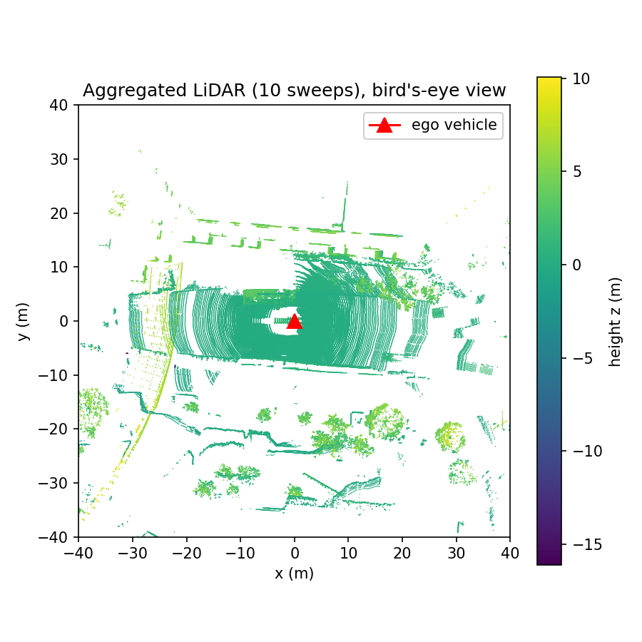
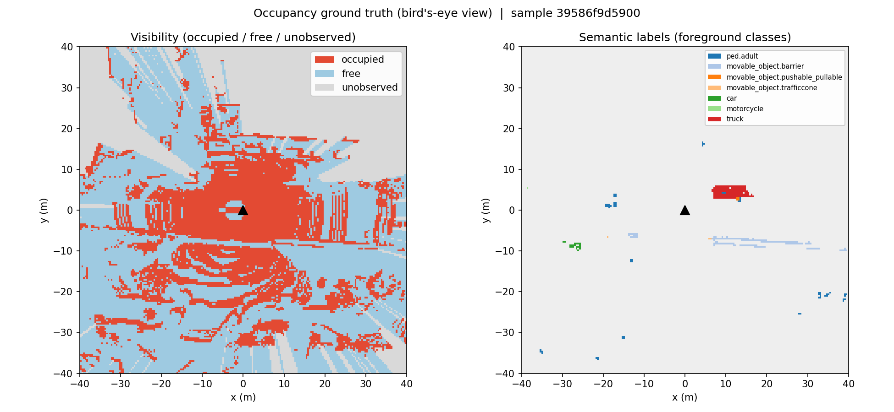

# End-to-End Occupancy Perception (nuScenes)

A modular pipeline that generates 3D occupancy ground truth from raw nuScenes
LiDAR and runs a training-ready deep-learning pipeline on it. The focus is
design, structure, and extensibility rather than model accuracy; the model is a
small placeholder.

## What it does

Ground-truth generation turns raw LiDAR into a voxel-grid occupancy target:

- aggregates multiple LiDAR sweeps into a dense point cloud, ego-motion
  compensated through the sensor-to-ego-to-global transform chain;
- voxelizes into a fixed grid (200 x 200 x 16 at 0.4 m, the Occ3D-nuScenes
  convention);
- labels voxels semantically from the 3D bounding boxes;
- ray-casts visibility with exact voxel traversal to distinguish free,
  occupied, and unobserved space, so the learning target never supervises
  occluded regions;
- serializes each keyframe to a compressed .npz, decoupling generation from
  training.

The deep-learning pipeline consumes the serialized GT with no dependency on the
nuScenes devkit: a torch Dataset, a registry-based encoder-neck-head model, and
a masked cross-entropy loss that ignores unobserved voxels, all driven by a
config.

## Example output

The figures below show the same nuScenes keyframe at two stages of the pipeline:
the aggregated LiDAR point cloud that the ground truth is built from, and the
resulting occupancy ground truth.

Aggregated LiDAR (10 sweeps), bird's-eye view, colored by height:

Occupancy ground truth, bird's-eye view. The left panel is visibility (occupied,
free, unobserved); the right panel is the semantic labels (foreground classes).
The grey wedges in the visibility panel are occlusion shadows: regions the LiDAR
could not observe because obstacles blocked the beam. They are marked unobserved
rather than free, which is exactly what a three-state occupancy target should do.
Where the LiDAR cloud above is empty, the occupancy grid marks unobserved.

## Repository layout

    occperc/
        gt/          GT generation: grid, aggregation, voxelizer, labeling,
                     visibility, serialization, orchestrator
        data/        torch Dataset over serialized GT
        models/      component registry and placeholder encoder-neck-head net
        losses/      masked cross-entropy loss
        engine/      training config and training loop
    scripts/         generate_gt.py and train.py (runnable entry points)
    configs/         example YAML config

## Dataset

Requires the nuScenes v1.0-mini split. Extract it so the directory contains samples/, sweeps/, maps/,
lidarseg/, and v1.0-mini/. The data is not included in this repository and is
mounted at runtime.

## Running with Docker (recommended)

Build the image (the dataset is not baked in; it is mounted at runtime):

    docker build -t occ-perception .

Generate GT for a few keyframes, mounting your nuScenes copy at /data:

    docker run --rm \
        -v /path/to/nuscenes:/data \
        occ-perception \
        python -m scripts.generate_gt --dataroot /data --out /tmp/gt --max-samples 3

Run the full pipeline (GT generation followed by the DL training loop) in one
container:

    docker run --rm \
        -v /path/to/nuscenes:/data \
        occ-perception \
        sh -c "python -m scripts.generate_gt --dataroot /data --out /tmp/gt --max-samples 3 && python -m scripts.train --gt-root /tmp/gt --epochs 10"

On Windows PowerShell, use your data path in the volume mount, for example
-v "C:\path\to\nuscenes:/data".

The device is auto-detected: the pipeline runs on GPU where a CUDA-enabled
torch build and a GPU are present, and on CPU otherwise, with no config change.
The provided image is CPU-only, which is sufficient since no model is trained.

## Running without Docker

    conda create -n occ python=3.10 -y
    conda activate occ
    pip install torch --index-url https://download.pytorch.org/whl/cpu
    pip install -r requirements.txt

Then generate GT and run the pipeline, pointing --dataroot at your nuScenes
directory:

    python -m scripts.generate_gt --dataroot /path/to/nuscenes --out gt_out --max-samples 3
    python -m scripts.train --gt-root gt_out --epochs 10

## Inspecting individual stages

Most modules have a self-test runnable as a module, for example:

    python -m occperc.gt.voxelizer --dataroot /path/to/nuscenes
    python -m occperc.gt.visibility --dataroot /path/to/nuscenes --subsample 4
    python -m occperc.losses.occupancy_loss

The bird's-eye-view figures above are produced by two standalone visualization
helpers:

    python -m scripts.visualize --root gt_out --index 1 --out figures/occupancy_bev.png
    python -m scripts.render_lidar --dataroot /path/to/nuscenes --frame 5 --out figures/lidar_bev.png

## Notes

- The grid bounds, sweep count, and ray-cast subsampling are configurable; see
  the module docstrings and configs/train.yaml.
- Generated GT is reproducible from the code and is not committed to the
  repository.
- Design rationale, trade-offs, and limitations are documented in the design
  report and inline in each module.

## Acknowledgements

This project uses the nuScenes devkit for data loading, multi-sweep
aggregation, and coordinate transforms, and PyTorch for the deep-learning
pipeline. The occupancy ground-truth methodology follows the conventions of
Occ3D-nuScenes and OpenOccupancy; visibility ray casting uses the Amanatides and
Woo (1987) voxel-traversal algorithm.
